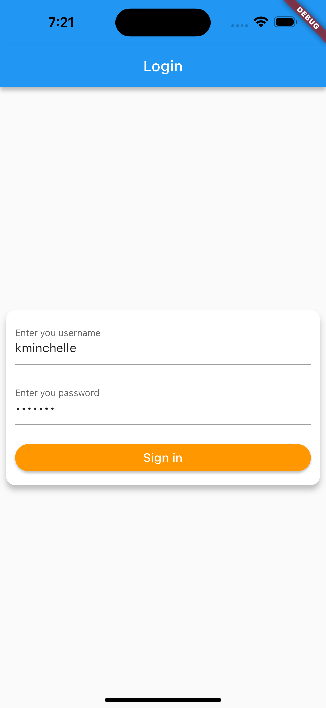
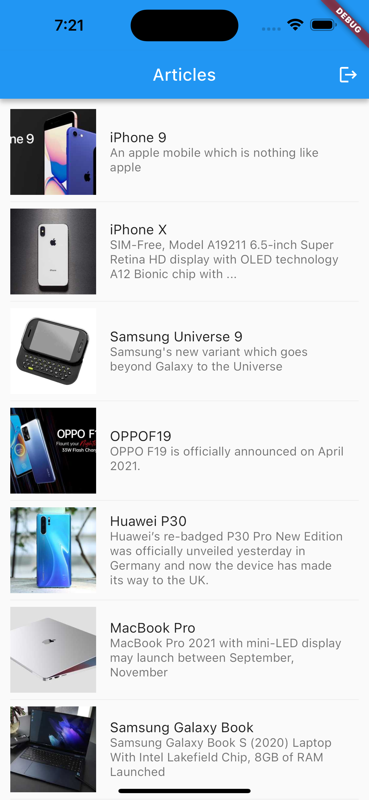

# Provider Template

### A sample project to demonstrate clean architecture with the provider for beginners

### Packages Used
1. provider
2. get_it
3. injectable
4. dartz
5. http
6. json_serializable
7. freezed
8. infinite_scroll_pagination
9. flutter_secure_storage
10. mocktail : dev dependency

### Project details
This project uses the tools and practices to demonstrate user authentication and a paginated list using sample APIs provided by https://dummyjson.com/
1. Provider
2. API calls with http
3. Unit tests
4. Dependency injection using get_it and injectables
5. Secured local storage
6. Flutter navigation

### Screens
<table>
  <tr>
     <td>Start</td>
     <td>Questionnaire List</td>
  </tr>
  <tr>
    <td></td>
    <td></td>
  </tr>
 </table>

